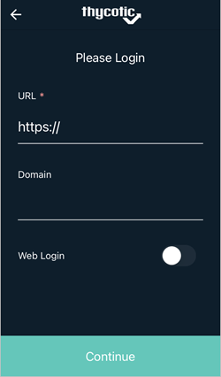
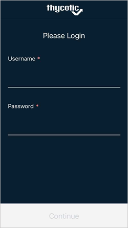
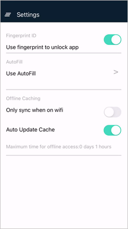
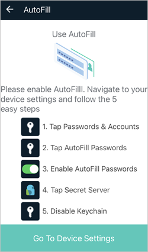

[title]: # (Configuring the Mobile Application)
[tags]: # (mobile,configuring,configuration)
[priority]: # (3)

# Configuring the Mobile Application

## Enabling Web (SAML) Login

SAML support allows users to login via Web Login.

To use the Web Login option

1. Navigate to your Secret Server Mobile apps login screen.

1. Enable the __Web Login__ switch.

   
1. Click __Continue__. You will see a quick page flash when the app reaches out to the server for the token generation.

   Your Login page now looks like this:

   

## Enabling Biometric Authentication

Thycotic recommends using biometric authentication instead of a password, either facial recognition (iOS only) or fingerprint ID (Android and iOS), if your mobile device supports it. You must enable biometric authentication to use offline caching features.

1. On the **Settings** page you can choose automation settings including **Use fingerprint to unlock app** instead of username and password.

   

1. Click **Go To Device Settings** and follow the directions on the **Use Autofill** page.

   

1. Click __OK__ to the trust prompt and follow the directions to enter your fingerprint

## Enabling Autofill

1. On the **Settings** page you can choose automation settings including **Use AutoFill** for usernames and passwords.

   

1. Click **Go To Device Settings** and follow the directions on the **Use Autofill** page.

   

