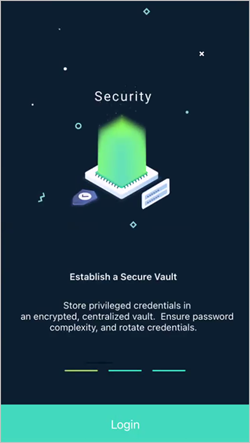
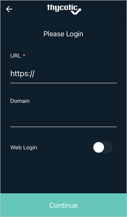

[title]: # (Logging Into the Mobile Application)
[tags]: # (mobile,login)
[priority]: # (4)

# Logging Into the Mobile Application

Following a successful installation, use the links in the onboarding email to run through the initial setup and login steps. Afterwards, you can enter the connection URL and user credentials following hte steps below. For information about enabling Web (SAML) login, multi-factor authentication, or biometric authentication, see the Configuration section.

1. Open the Secret Server Mobile application.

1. Click __Login__.

   
1. Enter your Secret Server instance URL, for example `websitename.domain.com/secretserver`.

   

   The Domain value is optional.

1. Click __Continue__.

1. Enter your __Username__ and __Password__ and click __Continue__.

   
