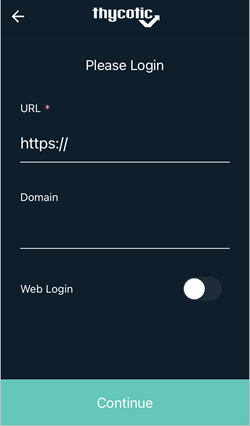

[title]: # (Downloading and Configuring the Mobile Application)
[tags]: # (mobile,configuring,configuration)
[priority]: # (3)

# Downloading and Configuring the Mobile Application

## Downloading the Mobile Application

Once the user receives the invitation email from the onboarding process to install and use the Secret Server Mobile application, they can use the following app store links to download and install the product:

* [Google Play Store](https://play.google.com/store/apps/details?id=com.thycotic.SecretServerMobile)
* [Apple App Store](https://apps.apple.com/us/app/id1509465103)

## Enabling Web (SAML) Login

SAML support allows users to login via Web Login.

To use the Web Login option

1. Navigate to your Secret Server Mobile apps login screen.

1. Enable the __Web Login__ switch.

   
1. Click __Continue__. You will see a quick page flash when the app reaches out to the server for the token generation.

   Your Login page now looks like this:

   

## Enabling Autofill

1. On the **Settings** page you can choose automation settings including **Use AutoFill** for usernames and passwords.

   

1. On the **Use Autofill** page, follow the directions and click **Go To Device Settings**.

   

## Enabling Biometric Authentication

Thycotic recommends using biometric authentication: either facial recognition (iOS only) or fingerprint ID (Android and iOS) in place of username and password credentials. You must enable biometric authentication to use offline caching features.

1. Navigate to the **Settings** page and select either fingerprint identification or facial recognition.

   

1. Click __OK__ at the trust prompt and follow the directions to enter your fingerprint.
