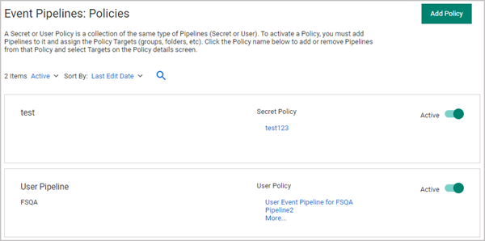

[title]: # (Configuration)
[tags]: # (mobile)
[priority]: # (2)
# Secret Server Configuration

Download the mobile app from the app store for your mobile device (available for iOS and
Android) by searching for Thycotic Secret Server Mobile.

## Configuration

Once launched, the mobile application needs to be configured to access your Secret Server instance. As a prerequisite, you need to make sure that your Secret Server instance has Web Services enabled.

1. Navigate to __Admin | Configuration | Application Settings__.
1. Verify that under __View Webservices__ the __Enable Webservices__ option is reflecting __Yes__.

While you’re here, you can also define the Maximum Time for Offline Access on Mobile Devices and Session Timeout for Webservices. For maximum security, do not choose Unlimited for session timeout and restrict offline access to just a few days.

The mobile onboarding process is handled and reviewable via the Event Pipelines: Policies in Secret Server:

If you are using Windows integrated authentication then you must enable __Anonymous__ access on the
web services folder in IIS. To do this, 

1. Expand the Secret Server website or virtual directory and select the webservices folder.
1. Double-click __Authentication__, then right-click __Anonymous Authentication__ and select __Enable__.

Now launch the app and fill in the fields with the correct information. The url field should be the
url you use to navigate to your Secret Server from the browser it could be:

`https://websitename.domain.com` or `https://websitename.domain.com/secretserver`

If you are using your active directory credentials then you must enter the fully-qualified domain name
(FQDN), if you are using local Secret Server account then this could be left empty.
Enter your two-factor information, if you have that enabled. Once logged in, you will see the Secrets list.

## Supported MFA

The application supports the same MFA mechanisms as used by Secret Server:  

* DUO – Push  
* DUO – Phone call
* Pin Code
* TOTP authenticators
* FIDO (NFC)

If available via device, the application supports biometric authentication instead of password or other types of MFA:

* Fingerprint (Android and iOS)
* Facial recognition (iOS only)

The application will auto-reconnect to Secret Server if the connection is temporarily dropped due to network issues and support for Secret Server login refresh token.
