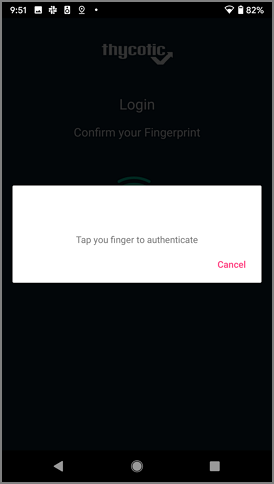

[title]: # (Mobile Setup)
[tags]: # (mobile)
[priority]: # (3)
# Mobile Setup

Once the user receives the invitation email from the onboarding process to install and use the Secret Server Mobile application, they use the provided app store links to download and install the product. The Secret Server Mobile application is available at

* [Google Play](TODO)
* [Apple App Store](TODO)

Following a successful installation users can manually enter the connection URL and user credentials or use the links in the onboarding email to run through the initial setup steps:

1. Open the Secret Server Mobile application.
1. Click __Login__.

   
1. Enter you Secret Server instance URL, for example `websitename.domain.com/secretserver`.

   

   The Domain value is optional.
1. Click __Continue__.
1. Enter your __Username__ and click __Continue__.
1. Enter your __Password__ and click __Continue__.
1. Thycotic recommends using biometrics if supported by your mobile device. Set the biometrics switch to on, in this case Fingerprint.

   
1. Click __Continue__.
1. During the initial login sequence, the application will also prompt if you prefer to enable auto-filling usernames and passwords.

   

   If you choose to enable autofill functionality, you navigate to the Settings page:

   

   1. Set the __Use AutoFill__ switch to on.

      
   1. Click __OK__ to the trust prompt and select the __Secret Server Autofill__ radio button.

The Secret Server Mobile is now ready for use on your mobile device.

If biometrics are enabled, the user will be prompted to authenticate via the enable biometrics functions on the next login:

