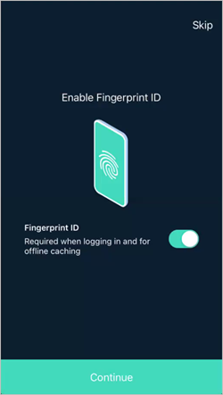
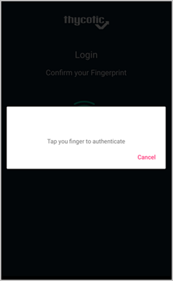

[title]: # (Setup)
[tags]: # (mobile)
[priority]: # (2)
# Setup

## Prerequisites in Secret Server

Provide an Onboarding process for users starting the mobile application for the first time 

Onboarding process would follow a path like: 
NOTE: This process is still being defined 

The Admin would open Secret Server and navigate to a screen for onboarding users into mobile 

If user selection is available, they would select the specific users or all users 

Admin would then click a button to create onboarding link (this might be a hyperlink, QR code, etc.) 

A code or link would be generated in Secret Server.  

Admin has some mechanism to copy the link or send it out to users 

## Initial Mobile Setup

Once the user receives the invitation to install and use the Secret Server Mobile application, they use the provided app store links to download and install the product. The Secret Server Mobile application is available at

* [Google Play]()
* [Apple App Store]()

Following a successful installation, run through these initial setup steps:

1. Open the Secret Server Mobile application.
1. Click __Login__.

   
1. Enter you Secret Server instance URL, for example `mycompany.com/SecretServer/`.

   
1. Click __Continue__.
1. Thycotic recommends using biometrics if supported by your mobile device. Set the biometrics switch to on, in this case Fingerprint.

   
1. Click __Continue__.
1. During the initial login sequence, the application will also prompt if you prefer to enable auto-filling usernames and passwords.

   

   If you choose to enable autofill functionality, you navigate to the Settings page:

   

   1. Set the __Use AutoFill__ switch to on.

      
   1. Click __OK__ to the trust prompt and select the __Secret Server Autofill__ radio button.

The Secret Server Mobile is now ready for use on your mobile device.

If biometrics are enabled, the user will be prompted to authenticate via the enable biometrics functions on next login:

