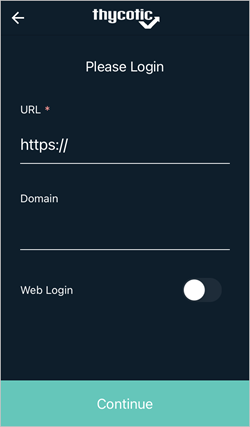

[title]: # (Mobile Setup)
[tags]: # (mobile)
[priority]: # (3)

# Mobile Setup

Once the user receives the invitation email from the onboarding process to install and use the Secret Server Mobile application, they use the provided app store links to download and install the product. The Secret Server Mobile application is available at

* [Google Play Store](https://play.google.com/store/apps/details?id=com.thycotic.SecretServerMobile)
* [Apple App Store](https://apps.apple.com/us/app/id1509465103)

Following a successful installation users can manually enter the connection URL and user credentials, or use the links in the onboarding email to run through the initial setup steps:

1. Open the Secret Server Mobile application.
1. Click __Login__.

   
1. Enter your Secret Server instance URL, for example `websitename.domain.com/secretserver`.

   

   The Domain value is optional.
1. Click __Continue__.

1. Enter your __Username__ and __Password__ and click __Continue__.

   

1. Thycotic recommends using biometric authentication, either facial recognition of fingerprint ID, if your mobile device supports it. You must enable biometric authentication to use offline caching features.

   
1. Click __Continue__.

1. On the **Settings** page you can choose automation settings including **Use AutoFill** for usernames and passwords.

   

1. Click **Go To Device Settings** and follow the directions on the **Use Autofill** page.

   

1. Click __OK__ to the trust prompt and follow the directions to enter your fingerprint.
