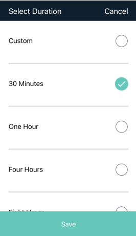

[title]: # (Checking Out Secrets)
[tags]: # (mobile,secret,checkout)
[priority]: # (3)

# Checking Out Secrets in the Mobile App

Some Secrets, especially Secrets that are shared across an organization, require the user to request and receive approval to access the Secret, and to check out the secret for their personal use for a specified period. During the process of requesting approval to access a Secret, the user can be prompted to enter security information such as a comment, ticket number, reason, or Double Lock password. The screen shots below show the sequence for specifying a check out period through the Request Approval, Select Duration, and Custom screens.

On the **Request Approval** screen, the user clicks to enter the duration value. Note that some scrolling-down might be required.

On the **Select Duration** screen, the user chooses a preset duration or chooses **Custom**. If the user chooses **Custom**, the Custom screen appears.

On the **Custom** screen, the user clicks to enter the duration value. Note that some scrolling-down might be required.

Secrets that are already checked out are marked as **Checked Out**.

## Launching a Web Password Secret

Users can launch Web Secrets directly from the Secret's details page.

1. Click the launcher icon in the top right of the details page.