[title]: # (Using the App)
[tags]: # (mobile)
[priority]: # (3)
# Using the Application

The application will display the Secrets in a UI similar to the Basic dashboard in Secret Server. Clicking on a Secret will expand it and show the Secret information. You will be able to edit and open the Secret in
browser. Clicking Edit allows you start editing the contents of the Secret.

The mobile app can be used to authenticate to a Secret Server instance (on-prem or cloud) and access secrets. The app has the ability to run the following actions for both Secrets and Folders:

* View, add, edit, delete
* Search based on:
  * Name
* Favorite
  * Users have access to their Favorites list as a separate tab and can favorite or un-favorite secrets, which is then synchronized between the mobile device and Secret Server and vice versa.
* Recent
  * Shows the user's 15 most recently accessed secrets.

Users access and use their secrets via mobile device, using the built-in password management features. When Users are logged in with their own account, users can navigate the Secret Server folder structure to access any of their Secrets.
The applications allows users to automatically fill credentials from Secrets into other mobile apps or Web browser sites on the mobile device. For this to work correctly, the application needs to be registered with the device's autofill service.

The application allows users to launch a web session from a Secret on the mobile device and have the credentials auto-populate in the mobile devices default browser.

## Navigating the Application

### Home Page

The Home page lets users browse existing Secrets and add new Secrets.

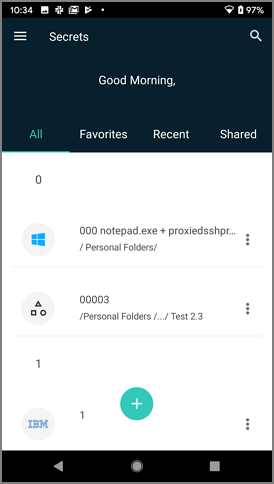

Use the __+__ icon to add new Secrets or folders to Secret Server.

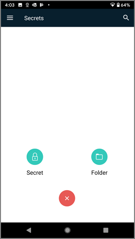

#### Ellipsis Options

Secrets and folders have ellipsis menus offering options such as view, edit, favorite, and delete. 
The options available are dynamic, based on the Secret and the user's permission levels.

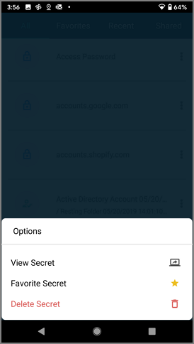

### Hamburger Menu

#### Folders

The Folders page lets users access and browse existing folders, and add new folders for secrets.

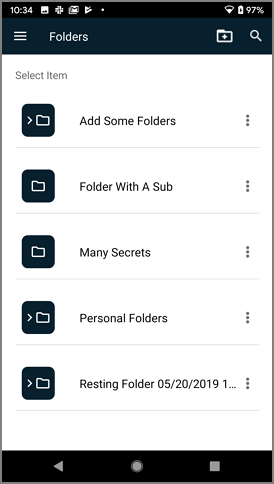

#### Change Password

The Change Password page uses the standard change password user workflow, asking for the existing password and then entering and confirming a new password.

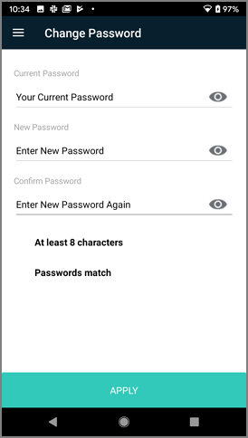

#### Settings

The Settings page is used to enable/disable biometrics and autofill functionality for the mobile application.

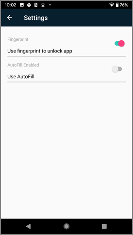

#### Feedback

The Feedback page allows users to provide a review of their experience with the Secret Server Mobile application.

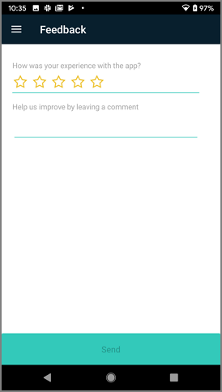

### Favorites

The Favorites page displays secrets the user has marked as favorites. It also populates the information for favorites secrets from the Secret Server instance based on user.

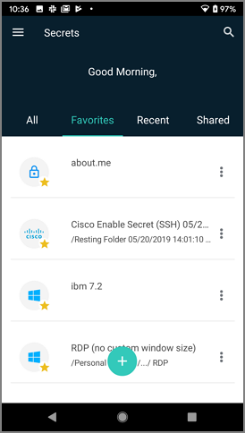

### Recent

The Recent page displays the Secrets the user has recently accessed or used.

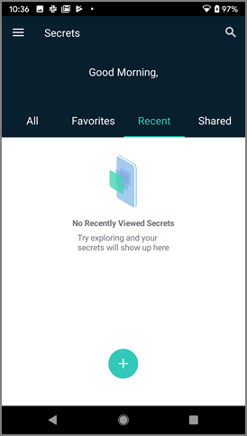

### Shared

The Shared page displays shared Secrets.

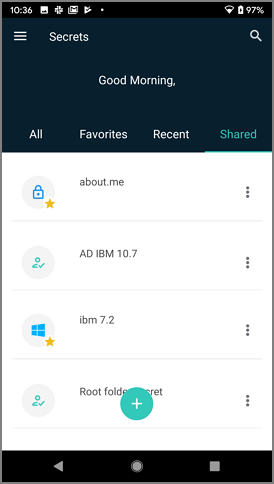

Some Secrets, especially Secrets that are shared across an organization, require the user to request and receive approval to access the Secret. During the process of requesting approval to access a Secret, the user can be prompted to enter security information such as a comment, ticket number, reason, or Double Lock password, and to check out the secret for their personal use for a specified period. The screen shots below show the sequence for specifying a check out period through the Request Approval, Select Duration, and Custom screens. 

On the **Request Approval** screen, the user clicks to enter the duration value. Note that some scrolling-down might be required.

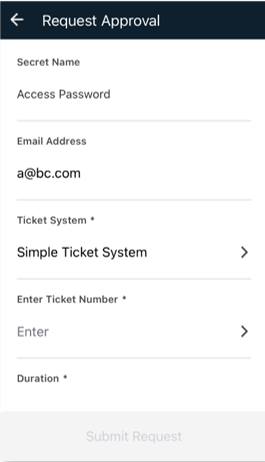

On the **Select Duration** screen, the user chooses a preset duration or chooses **Custom**. If the user chooses **Custom**, the Custom screen appears.

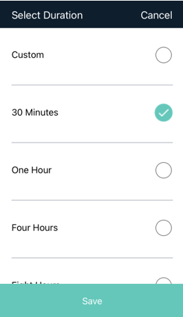

On the **Custom** screen, the user clicks to enter the duration value. Note that some scrolling-down might be required.

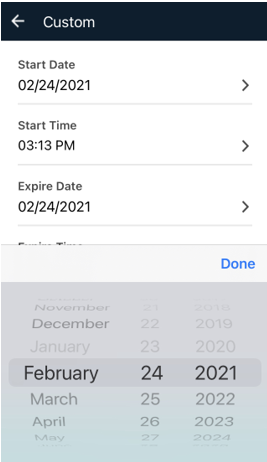

Secrets that are already checked out are marked as **Checked Out**.

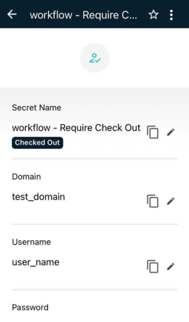

## Launching a Web Password Secret

Users can launch Web Secrets directly from the Secret's details page.

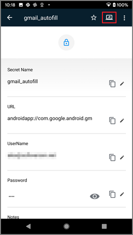

1. Click the launcher icon in the top right of the details page.

## Autofill

When the Autofill service is enabled on the device, the Secret Server Mobile application works with the devices built-in autofill features to fill username and password fields for web pages or other mobile applications.

When you select the mobile application or web page and click on the username field you should see a prompt to use the autofill service from Secret Server Mobile. Clicking this option will open the app and (after logging in if needed) it runs a search of your secrets for:

* Browser web site - The search will be run looking for any secret that has the same Domain value in the URL
* Other mobile application - The search will run looking for any secret that has the same name or URL value as the name of the mobile application that is being filled.

Users can also choose to manually modify the search value and run it again. Once the list of Secret Server Secrets has been returned, you can select which one you want to use and the autofill service will fill those credentials in the related username and password fields.

>**Note**: Currently the autofill service supports only the username and password fields.

## Secret Workflows

From **Autofill**, **Home**, **Favorites**, **Recents**, and **Shared** screens, Secret workflows provide users with screens, confirmations, notices, prompts, indications, and controls related to: 

* checking out and checking in a Secret 
* submitting, resubmitting, and canceling a request for access to a Secret
* submitting a **Double Lock** password or a **Ticket Comment**, **Reason**, or **Number** to access a Secret
* confirmation of submission, approval, denial, or cancellation of an access request 
* notification of a duplicate request for access to a Secret 
* notification of login failure with the reason for failure
* provision of access to a Secret, including details and options, upon approval 
* setting a duration and a beginning and end time for accessing a Secret, now or at a later date 
* visual indication of each Secret you have checked out, from both Secret Server Mobile and the Secret Server web interface 
* visual indication that a Secret is checked out by another user
* entering a **Comment** and checking out a Secret at the same time 

