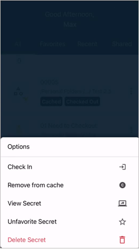
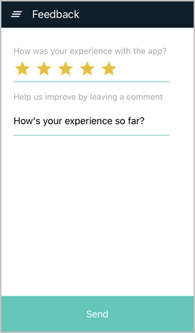

[title]: # (Navigating the Mobile Application)
[tags]: # (mobile,interface,navigation)
[priority]: # (3)

# Navigating the Application

Through the Secret Server Mobile application, users can authenticate to a Secret Server instance and access secrets using built-in password management features. The mobile application displays secrets in an interface similar to the Secret Server interface.

Users can navigate in the mobile application to view secrets and secret folders. They can also add and delete secrets, as well as click on a secret to examine and edit it.

By registering Secret Server Mobile with a mobile device's autofill service, users can launch a web session from a secret on the mobile device and automatically populate login credentials on specified web sites.

## Navigating the Application

### Home Page

The Home screen offers several options enabling users to view secrets. The Search feature (magnifying glass icon) enables users to search for secrets by name. Four tabs on the Home page enable users to view four different subsets of secrets:

* **All**: all secrets the user has view access to

* **Favorites**: secrets the user has designated as "Favorite"

* **Recent**: the 15 secrets most recently used by the user

* **Shared**: secrets shared between the user and other users

Use the __+__ icon to add new Secrets or folders to Secret Server.

#### Ellipsis Options

Secrets and folders have ellipsis menus offering options such as view, edit, favorite, and delete. 
The options available are dynamic, based on the Secret and the user's permission levels.

### Hamburger Menu

#### Folders

The Folders page lets users access and browse existing folders, and add new folders for secrets.

#### Change Password

The Change Password page uses the standard change password user workflow, asking for the existing password and then entering and confirming a new password.

#### Settings

The Settings page is used to enable/disable biometrics and autofill functionality for the mobile application.

#### Feedback

The Feedback page allows users to provide a review of their experience with the Secret Server Mobile application.

### Favorites

The Favorites page displays secrets the user has marked as favorites. It also populates the information for favorites secrets from the Secret Server instance based on user.

### Recent

The Recent page displays the Secrets the user has recently accessed or used.

### Shared

The Shared page displays shared Secrets.

