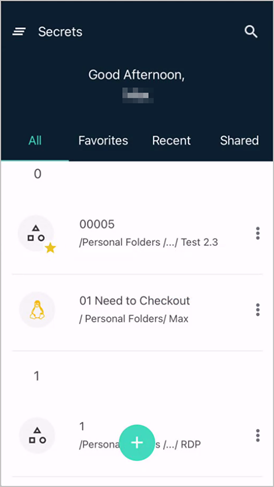

[title]: # (Using the App)
[tags]: # (mobile)
[priority]: # (3)
# Using the Application

The application will display the Secrets in a UI similar to the Basic dashboard in Secret Server. Clicking on
a Secret will expand it and show the Secret information. You will be able to edit and open the Secret in
browser. Clicking Edit allows you start editing the contents of the Secret.

The mobile app can be used to authenticate to a Secret Server instance (on-prem or cloud) and access secrets. The app has the ability to run the following actions for both Secrets and Folders:

* View, add, edit, delete
* Search based on:
  * Name
  * Template
* Favorite
  * List from SS
  * Can add Secrets to list from Star icon in mobile app
* Recent
  * List of most recently accessed Secrets
  * Limit list to last 15

Users access and use their secrets via mobile device, using the built-in password management features. When Users are logged in with their own account, users can navigate the Secret Server folder structure to access any of their Secrets.
The applications allows users to automatically fill credentials from Secrets into other mobile apps or Web browser sites on the mobile device. For this to work correctly, the application needs to be registered with the device's autofill service.

The application allows users to launch a web session from a Secret on the mobile device and have the credentials auto-populate in the mobile devices default browser.

## Navigating the Application

### Home Page

The Home page lets users browse existing and add new secrets.

### Hamburger Menu

#### Folders

The Folders page lets users access and browse existing folders and also add new folders for secrets.

#### Change Password

The Change Password page uses the standard change password user flow asking for the existing password and then entering and confirming a new password.

#### Settings

The Settings page is used to enable/disable biometrics and autofill functionality for the mobile application.

#### Feedback

The Feedback page allows users to provide a review of their experience with our mobile application.

### Favorites

The Favorites lists the secrets marked as favorites in the mobile application. It also populates the information for favorites secrets from the Secret Server instance based on user.

### Recent

The Recent page provides the list of recently accessed/used secrets.

### Shared

The Shared page provides the list of shared secrets.

