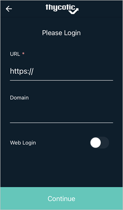
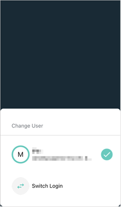
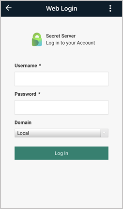

[title]: # (Logging Into the Mobile Application)
[tags]: # (mobile,login, log in)
[priority]: # (3)

# Logging Into the Mobile Application

## Using Standard Login

1. Open the mobile application on your mobile device. The first **Please Login** screen appears.

1. Enter your **URL** and **Domain**.

   

1. Click __Continue__ to open the second **Please Login** screen.

   

1. Enter your **Username** and **Password**.

1. Click __Continue__.

## Switching User Login

The mobile application supports switching the user.

1. Select the Hamburger menu on the top left.

   

1. Click the currently logged in user.

   

1. On the __Change User__ page, select __Switch Login__.

   

   A prompt appears with information about switching users.

   

1. Click __Yes__.
1. On the first **Please Login** screen, enter your **URL** and **Domain**. In some cases you will use the same URL and Domain you used for this first user.

   

1. Click __Continue__ to open the second **Please Login** screen.

   

1. Enter your **Username** and **Password**.
1. Click __Continue__.

## Switching Login Method

With Web Login enabled in the Secret Server Mobile app, the user can switch between standard and web login at any time. For example if your are logged in using the standard login method, you can switch to the web login method using the following procedure.

1. Select the Hamburger menu on the top left.

   

1. Click the currently logged in user.

   

1. On the __Change User__ page, select __Switch Login__.

   

   A prompt appears with information about switching login methods.

   

1. Click __Yes__.

1. On the first **Please Login** screen, enter your **URL** and **Domain**

1. Click the switch next to **Web Login** to switch to the web login method.

   

   The **Web Login** page opens

   

1. Enter your **Username** and **Password**.
1. Enter your **Domain** as appropriate.
1. Click **Log In**.

## Refreshing Web Login

With the Web Login enabled in the Secret Server Mobile app, the user can manually refresh the SAML token.

1. On the Web Login page, click the __ellipsis__ in the top right corner

   

1. Under __Options__, select __Refresh Web Login__.

   

You will see a quick page flash when the app generates a new token.
