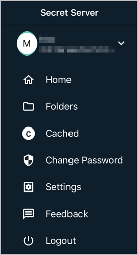
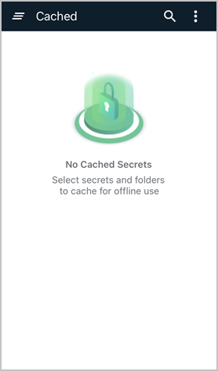
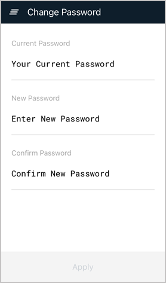
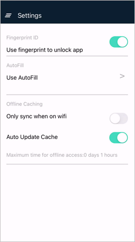

[title]: # (Navigating the Mobile Application Interface)
[tags]: # (mobile,interface,navigation)
[priority]: # (3)

# Navigating the Mobile Application Interface

The Secret Server Mobile application interface has been designed to be similar to the Secret Server interface to make it easy for  users to search and browse through folders and secret collections to quickly find specific folders and secrets.

Users can then open, inspect, add, edit, or delete folders and secrets, mark them as Favorites, and designate them for availability offline.

The interface also makes functionality readily accessible, such as multi-factor authentication, biometric authentication, autofill, online and offline caching, and advanced secret workflows.

## Navigating the Application

After the user opens and logs into the mobile application, the Home screen appears.

### Home Screen

The Home screen offers several options enabling users to view secrets. The Search feature (magnifying glass icon) enables users to search for secrets by name. Four tabs on the Home page enable users to view their secrets four different ways:

* **All**: all secrets the user has view access to

* **Favorites**: secrets the user has designated as "Favorite"

* **Recent**: the 15 secrets accessed most recently by the user

* **Shared**: secrets shared between the user and other users

The Home screen displays a prominent Add icon  near the bottom enabling users to quickly add folders and secrets. Secrets and folders on the Home screen and elsewhere display a vertical ellipses  along one side.

Clicking an ellipses opens access to options that are generated dynamically, meaning that the options presented match the actions the user is likely to want to make at that moment. These actions can include view, delete, edit, cache, refresh cache, remove from cache, check in or check out, favorite or unfavorite, request access. etc.

### Side Navigation

In the top left corner of the Home screen is an icon composed of three horizontal lines stacked atop one another, sometimes in a straight stack and sometimes slightly askew. This icon is popularly known as a "hamburger."  

Clicking the hamburger icon opens up a side navigation panel with useful options.

Clickable components on the side navigation panel include the following, from top to bottom:

* The name of the user currently logged in (blurred out in the image).

* **Home** takes the user directly back to the Home screen.

* **Folders** displays the the tree full structure of the user's folders and secrets.

  

* **Cached** displays any folders and secrets the user has designated to be cached for offline use.

  

* **Change Password** displays standard options for confirming your current password and quickly changing to a new one.

  

* **Settings** displays options for the user to activate or deactivate functions like biometric authentication, autofill, only synching when on wifi, and automatically updating the cache.  

  

* **Feedback** allows users to provide a review of their experience with the Secret Server Mobile application.

  

* **Logout** immediately logs the user out when it is clicked, and shows the login screen.

