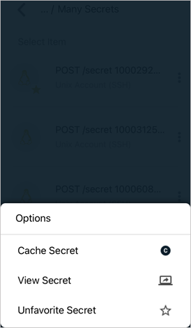
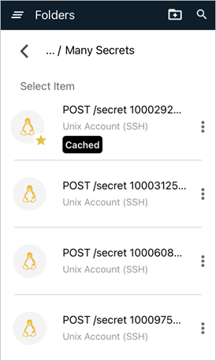
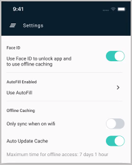

[title]: # (Using Secrets from an Offline Cache)
[tags]: # (mobile,cache,offline)
[priority]: # (3)

# Using Secrets from an Offline Cache

Like users of any mobile network device, users of the Secret Server Mobile application can lose internet connectivity for a number of reasons, and be cut off from accessing their secrets from Secret Server. And sometimes it’s just easier to use secrets from an offline cache rather than connecting to Secret Server every time you need your secrets. The mobile application enables users to specify secrets and secret folders to save to an offline cache, so they can be used without being connected to Secret Server.

Follow the procedures below to:

* Select secrets to be available offline
* Set the time you need to keep secrets available offline
* See at a glance which secrets are stored in offline cache
* See at a glance how much longer a secret will be available in offline cache

## Select Secrets to be Available Offline

To make a secret available for offline use, select the secret and click the ellipses on the side.
In the menus that appears, select **Cache Secret**.

Set the time you need to save the secret in offline cache.

When you have secrets saved to offline cache, they are marked with a "Cached" tag for easy identification.

On the Settings tab, you can see how much time is left before your offline cache expires.

