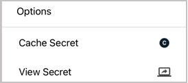
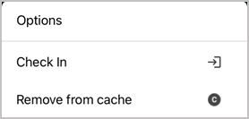
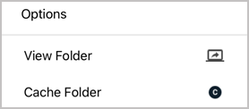
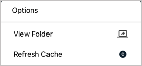
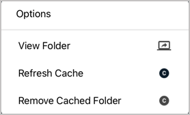

[title]: # (Using Secrets from an Offline Cache)
[tags]: # (mobile,cache,offline)
[priority]: # (600)

# Offline Caching

Mobile devices and applications can lose internet connectivity for a number of reasons. When Secret Server Mobile loses internet connectivity, users cannot access their secrets directly from Secret Server. But an organization can permit its Secret Server Mobile users to save secrets and secret folders to an offline cache. Offline caching stores secrets, secret folders, and all of their associated data to a password-protected, encrypted data file. When a network connection to Secret Server is unavailable, users can access secrets and folders cached offline for a maximum Time-To-Live (TTL) period. TTL and access to offline caching are controlled by an organization’s Secret Server administrator globally, for all mobile devices in the organization. If an organization does not allow offline caching, the administrator sets the TTL to zero.

Accessing secrets saved to an offline cache requires using biometric face or fingerprint recognition. The offline cache is automatically updated by default, but a user can turn off the auto-update feature. The offline cache is automatically cleared when the user logs out of the application or switches to another user identity.

# Add and Remove a Secret for Offline Caching

To add and remove a secret for offline caching, follow the procedure below:

1. Connect to Secret Server.

1. Select the secret and click the ellipsis on the side.

1. Click **Cache Secret**.

   

1. To remove the secret from offline cache, select the secret, click the ellipsis on the side, and click **Remove from cache**.

   

# Add, Refresh, and Remove a Folder for Offline Caching

To add, refresh, and remove a secret folder for offline caching, follow the procedure below:

1. Connect to Secret Server.

1. Select the secret folder and click the ellipsis on the side.

1. Select the **Cache Folder** option. When you cache a folder, the secrets in the folder are cached, but secrets in subfolders are not cached.

   

   When you add a secret to a cached folder, you need to refresh the folder by clicking the ellipsis and clicking **Refresh Cache**.

      

1. To remove a folder and all secrets inside it from the offline cache, select the folder and click the ellipsis on the side, then click **Remove Cached Folder**.

   

## Identify Cached Secrets

When you have secrets saved to offline cache, they are marked with a "Cached" tag for easy identification.

Cached secrets whose time has expired are marked with an "Expired" tag.

## See How Much Time Remains for Accessing Secrets in the Offline Cache

When you open a secret, the time remaining until expiration is shown at the top of the screen. The default background is black.

When the secret has just 24 hours or less until expiration, the background changes to red for easy identification.

