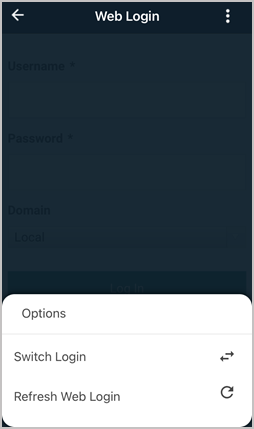

[title]: # (Refresh Web Login)
[tags]: # (mobile)
[priority]: # (5)
# Refresh Web Login

With the Web Login enabled in the Secret Server Mobile app, the user can manually refresh the SAML token.

1. On the Web Login page, click the __ellipsis__ in the top right corner

   

1. Under __Options__, select __Refresh Web Login__.

   

You will see a quick page flash when the app generates a new token.