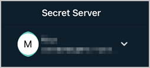
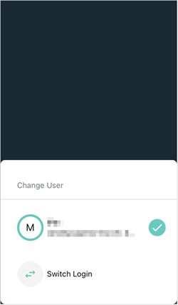
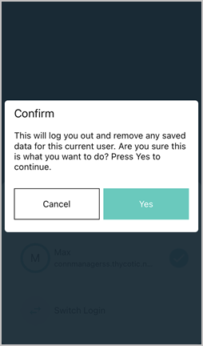
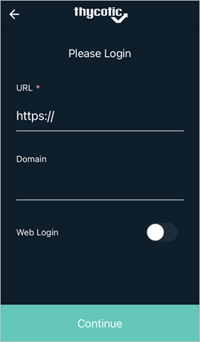
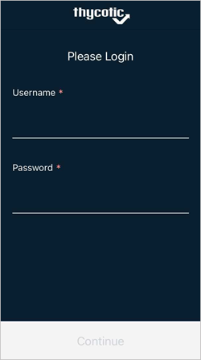
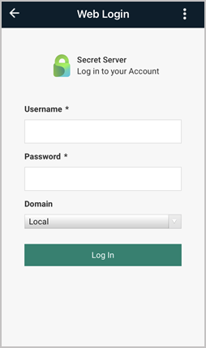

[title]: # (Switch Login)
[tags]: # (mobile)
[priority]: # (4)

# Switching the Login

## Switch Users

The mobile application supports switching the user.

1. Select the Hamburger menu on the top left.

   

1. Click the currently logged in user.

   

1. On the __Change User__ page, select __Switch Login__.

   

   A prompt appears with information about switching users.

   

1. Click __Yes__.
1. On the first **Please Login** screen, enter your **URL** and **Domain**. In some cases you will use the same URL and Domain you used for this first user.

   

1. Click __Continue__ to open the second **Please Login** screen.

   

1. Enter your **Username** and **Password**.
1. Click __Continue__.

## Switch Normal and Web Login

With Web Login enabled in the Secret Server Mobile app, the user can switch between standard and web login at any time.

1. Select the Hamburger menu on the top left.

   

1. Click the currently logged in user.

   

1. On the __Change User__ page, select __Switch Login__.

   

   A prompt appears with information about switching users.

   

1. Click __Yes__.

1. On the first **Please Login** screen, enter your **URL** and **Domain**, and click to activate the switch next to **Web Login**.

   

   The **Web Login** page opens

   

1. Enter your **Username** and **Password**.
1. Enter your **Domain** as appropriate.
1. Click **Log In**.
