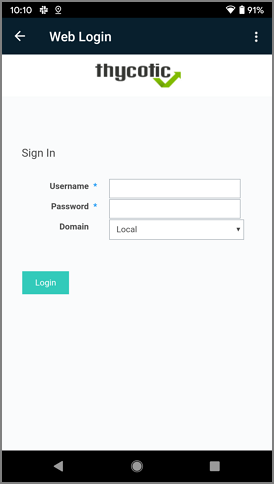

[title]: # (Switch Login)
[tags]: # (mobile)
[priority]: # (4)
# Switching the Login

The mobile application supports to switch the user/login. 

1. Select the Hamburger menu on the top left.
1. Click the currently logged in user.
1. On the __Change User__ page, select __Switch Login__.

   
1. Confirm your action, click __Yes__.
1. On the __What is your URL?__ page either enter a different instance for the new login or keep the known URL and click __Continue__ to access the __What is your username?__ page.
1. Enter your Username, click __Continue__.
1. Enter your Password, click __Continue__.

## Switching to Web Login

With the Web Login enabled in the Secret Server Mobile app, the user can switch between standard and web login at any time.

On the Web Login page:

1. Click the __ellipsis__ in the top right corner.

   
1. Under __Options__, select __Switch Login__.
1. Confirm the login switch, click on __Yes__.

   
